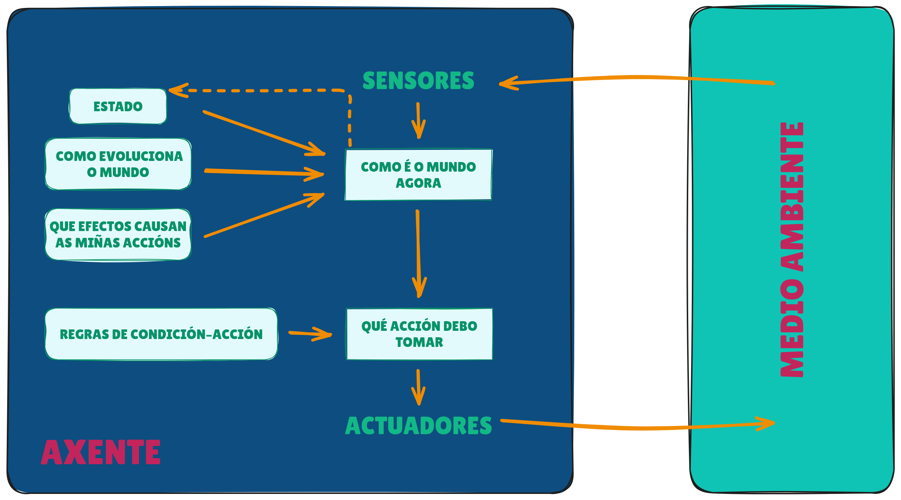

PPT-MarioUg  
==================  

Repositorio para o proxecto Pedra, Papel, Tesoiras da materia Modelos de Intelixencia Artificial.  

O obxectivo de esta tarefa e crear un axente que se base nos resultados de partidas anteriores para tentar predicir o seguinte movemento do adversario e así maximizar a súa probabilidade de vitoria.  

Contorna de tarefas  
==================  

| **Contorna de tarefas** | **Observable** | **Axentes** | **Determinista** | **Episódico** | **Estático** | **Discreto** | **Coñecido** |  
|:-----------------------:|:--------------:|:-----------:|:----------------:|:-------------:|:------------:|:------------:|:------------:|  
| RPS                    | Parcial        | Multiaxente | Estocástico      | Episódico      | Estático      | Discreto      | Coñecido     |  

**RPS** ⮞ Contorno simple, baseado na interacción por turnos entre o modelo e o oponente.

**Parcial** ⮞ O axente non ten acceso á seguinte acción do oponente nin á lóxica que rexe as súas accións, pero si pode observar o historial de turnos xogados ata o momento.

**Multiaxente** ⮞ Interveñen na tarefa tanto o modelo como o seu oponente.

**Estocástico** ⮞ O resultado dunha acción non é completamente predecible, xa que depende tanto das decisións do oponente como de posibles compoñentes de aleatoriedade no contorno.

**Episódico** ⮞ Cada partida é independente do resto; o resultado dunha partida non afecta á seguinte, aínda que o modelo pode valerse dos resultados anteriores para trazar a súa estratexia.

**Estático** ⮞ O escenario da tarefa non se modifica durante a partida, esta desenvólvese sen cambios dinámicos no entorno.

**Discreto** ⮞ A variedade de accións/estados e finita (Pedra, Papel ou Tesoiras).

**Coñecido** ⮞ As regras do xogo son coñecidas polos participantes e non se modifican en ningún momento da partida.

Estrutura do axente
==================  

🔴 **Axente** ⮞ É o xogador automatizado que toma decisións baseándose na información acumulada das partidas anteriores e nos patróns detectados no comportamento do opoñente. O axente actúa de maneira pseudo-racional, buscando maximizar as súas posibilidades de éxito en cada partida.

🟢 **Sensores** ⮞ Captan información do entorno, como o último movemento do opoñente e o resultado da última partida, actualizando así os datos dispoñibles para o axente.

🟠 **Como é o mundo agora** ⮞ Xera unha representación actualizada do xogo, combinando a información do último movemento do opoñente, os resultados recentes e os patróns detectados no historial.

🟣 **Estado** ⮞ Almacena o historial das partidas anteriores, gardando os movementos do opoñente e os resultados das partidas. Esta información permite identificar posibles patróns de xogo do adversario.

🟣 **Como evoluciona o mundo** ⮞ Analiza as tendencias nos movementos do opoñente ao longo das partidas, baseándose nos datos almacenados no estado, para detectar cambios na estratexia do adversario.

🟣 **Que efectos causan as miñas accións**  ⮞ Avalía os resultados das accións do axente (como a elección de pedra, papel ou tesoira) en función das reaccións do opoñente, determinando se as estratexias empregadas foron efectivas ou non.

🟠 **Que acción debo tomar** ⮞ Decide cal é a mellor opción a xogar (pedra, papel ou tesoira) en función dos patróns detectados, o estado actual do xogo e as regras definidas.

🟣 **Regras de condición–acción** ⮞ Conxunto de regras que guían as decisións do axente. Por exemplo, se detecta que o opoñente tende a repetir os seus últimos movementos, pode contrarrestalos baseándose no patrón identificado.

🟢 **Actuadores** ⮞ Executan a decisión tomada polo axente, seleccionando pedra, papel ou tesoira para xogar a seguinte partida.

🔴 **Medio ambiente** ⮞ Inclúe o opoñente e as regras do xogo, proporcionando ao axente o contexto no que se desenvolven as partidas.