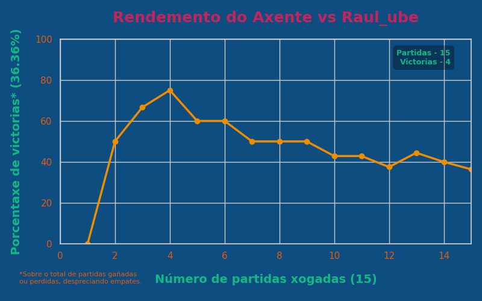

# Pedra, Papel, Tesoiras - Mario Ubeira González

Repositorio para o proxecto Pedra, Papel, Tesoiras da materia Modelos de Intelixencia Artificial.  

O obxectivo principal desta tarefa é crear un axente que trate de obter a mellor porcentaxe de vitorias posibles no Pedra, Papel, Tesoiras. Para iso, optei por implementar un axente reactivo baseado en modelos, que se serve dun historial personalizado das xogadas de cada adversario para detectar patróns no seu comportamento. Ademais disto, o axente emprega conceptos de probabilidade e as regras da cadea de Markov para predicir os movementos futuros do opoñente, optimizando así as súas decisións e maximizando as probabilidades de vitoria en cada partida.

## 1. Especificación da contorna de tarefas  

| **Contorna de tarefas** | **Observable** | **Axentes** | **Determinista** | **Episódico** | **Estático** | **Discreto** | **Coñecido** |  
|:-----------------------:|:--------------:|:-----------:|:----------------:|:-------------:|:------------:|:------------:|:------------:|  
| RPS                    | Parcial        | Multiaxente | Estocástico      | Episódico      | Estático      | Discreto      | Coñecido     |  

**RPS** ⮞ Contorno simple, baseado na interacción por turnos entre o modelo e o oponente.

**Parcial** ⮞ O axente non ten acceso á seguinte acción do oponente nin á lóxica que rexe as súas accións, pero si pode observar o historial de turnos xogados ata o momento.

**Multiaxente** ⮞ Interveñen na tarefa tanto o modelo como o seu oponente.

**Estocástico** ⮞ O resultado dunha acción non é completamente predecible, xa que depende tanto das decisións do oponente como de posibles compoñentes de aleatoriedade no contorno.

**Episódico** ⮞ Cada partida é independente do resto; o resultado dunha partida non afecta á seguinte, aínda que o modelo pode valerse dos resultados anteriores para trazar a súa estratexia.

**Estático** ⮞ O escenario da tarefa non se modifica durante a partida, esta desenvólvese sen cambios dinámicos no entorno.

**Discreto** ⮞ A variedade de accións/estados e finita (Pedra, Papel ou Tesoiras).

**Coñecido** ⮞ As regras do xogo son coñecidas polos participantes e non se modifican en ningún momento da partida.

## 2. Identificación do tipo de axente e estrutura 

**Axente reactivo baseado en modelos**: Un axente reactivo baseado en modelos é un xogador que, en lugar de simplemente reaccionar en base a instruccións preestablecidas, e capaz de lembrar o que sucedeu en partidas anteriores e utilizar esa información para mellorar as súas decisións futuras. Este tipo de axente non precisa facer cálculos moi complexos nin planificar a longo prazo; o que lle permite responder de maneira inmediata aos movementos do adversario, pero facendo uso da experiencia. A súa principal vantaxe é que, ao almacenar e analizar os movementos anteriores, pode detectar patróns no xogo do opoñente e adaptarse a eles, aumentando as súas posibilidades de gañar nas seguintes partidas.

En resumo, este axente aprende dos erros e acertos previos e utiliza esa memoria para tomar decisións máis intelixentes e efectivas no xogo. Por iso, considéroo o tipo de axente máis adecuado para este caso.


🔴 **Axente** ⮞ É o xogador automatizado que toma decisións baseándose na información acumulada das partidas anteriores e nos patróns detectados no comportamento do opoñente. O axente actúa de maneira racional, buscando maximizar as súas posibilidades de éxito en cada partida.

🟢 **Sensores** ⮞ Captan información do entorno, como o último movemento do opoñente e o resultado da última partida, actualizando así os datos dispoñibles para o axente.

🟠 **Como é o mundo agora** ⮞ Xera unha representación actualizada do xogo, combinando a información do último movemento do opoñente, os resultados recentes e os patróns detectados no historial.

🟣 **Estado** ⮞ Almacena o historial das partidas anteriores, gardando os movementos do opoñente e os resultados das partidas. Esta información permite identificar posibles patróns de xogo do adversario.

🟣 **Como evoluciona o mundo** ⮞ Analiza as tendencias nos movementos do opoñente ao longo das partidas, baseándose nos datos almacenados no estado, para detectar cambios na estratexia do adversario.

🟣 **Que efectos causan as miñas accións**  ⮞ Avalía os resultados das accións do axente (como a elección de pedra, papel ou tesoira) en función das reaccións do opoñente, determinando se as estratexias empregadas foron efectivas ou non.

🟠 **Que acción debo tomar** ⮞ Decide cal é a mellor opción a xogar (pedra, papel ou tesoira) en función dos patróns detectados, o estado actual do xogo e as regras definidas.

🟣 **Regras de condición–acción** ⮞ Conxunto de regras que guían as decisións do axente. Por exemplo, se detecta que o opoñente tende a repetir os seus últimos movementos, pode contrarrestalos baseándose no patrón identificado.

🟢 **Actuadores** ⮞ Executan a decisión tomada polo axente, seleccionando pedra, papel ou tesoira para xogar a seguinte partida.

🔴 **Medio ambiente** ⮞ Inclúe o opoñente e as regras do xogo, proporcionando ao axente o contexto no que se desenvolven as partidas.

## 3. Ampliación: RPSLS

Versión ampliada RPSLS (Pedra, Papel, Tesoiras, Lagarto, Spock) implementada no xogo. Neste modo introdúcense dúas novas accións: Lagarto e Spock, coas seguintes regras adicionais:

**Pedra** ⮞ Gaña contra Tesoiras e Lagarto pero perde contra Papel e Spock.

**Papel** ⮞ Gaña contra Pedra e Spock pero perde contra Tesoiras e Lagarto.

**Tesoiras** ⮞ Gaña contra Papel e Lagarto pero perde contra Pedra e Spock.

**Lagarto** ⮞ Gaña contra Spock e Papel pero perde contra Tesoiras e Pedra.

**Spock** ⮞ Gaña contra Tesoiras e Pedra pero perde contra Papel e Lagarto.

Para xogar no modo RPSLS, debes seleccionalo ao comezo do programa mediante a terminal, cando apareza a seguinte mensaxe:
``` bash
Escolle o modo de xogo: RPS[0], RPSLS[1], Axuda[8], Saír[9]: 1
```

## 4. Conclusións

### 4.1 RPS

No modo RPS, tras probar distintas estratexias, deime conta de que é un xogo moi simple e fácil de predicir. Ao poder visualizar o historial de partidas na terminal, o usuario sería sempre capaz de determinar a lóxica de movementos que segue o axente e adaptarse a ela. Isto evidénciase na imaxe, onde o meu irmán, tras comezar perdendo contra o axente, foi capaz de intuír os seus movementos e vencelo despois de tan só catro roldas:



Con esta observación dínme conta de que, co historial visible, a mellor opción para o axente sería actuar de maneira aleatoria ou utilizando patróns mínimos indetectables, polo que decidín que o mellor sería borrar a terminal despois de cada partida.

Sen o historial de partidas, optei por un método que combina tres estratexias diferentes cun compoñente de aleatoriedade entre elas: 
- Un 45% das veces o axente intenta predir o seguinte movemento baseándose nunha matriz de Markov simple.
- Outro 45% actúa segundo a porcentaxe de uso de cada movemento do usuario.
- O 10% restante elixe un movemento de forma completamente aleatoria.

Ademais, engadín un comprobante para que, se se detecta algún patrón simple no últimos tres movementos do usuario, o axente actúe en consecuencia. Isto implementouse co fin de que o axente fose o máis impredicible posible.

En conclusión, para que o meu axente lograse boas porcentaxes de vitoria sen ser facilmente explotable, tiven que achegar o seu razoamento á aleatoriedade. Dado que sendo tan sinxelo o xogo, resulta moi fácil detectar patróns. Así como o axente está programado para detectar e explotar patróns, o usuario tamén pode contraatacar explotando os do axente. Por tanto, considero que o máis efectivo é dotar ao axente dunha pseudoaleatoriedade que lle permita predicir os movementos do usuario sen ser vulnerable a ser explotado.

### 4.1 RPSLS

O modo RPSLS engade máis variantes ao xogo, o que o fai moito máis difícil de predicir en comparación co modo RPS estándar. A inclusión de dous movementos adicionais, Lagarto e Spock, incrementa a complexidade do xogo e reduce a posibilidade de detectar patróns simples nas decisións do opoñente.

Este aumento da complexidade fai que teña máis sentido dotar ao axente dunha intelixencia máis avanzada. Neste modo, o uso de estratexias como a predición baseada en matrices de Markov e a análise probabilístico dos movementos do adversario vólvese máis relevante. A maior variedade de combinacións posibles permite que o axente poida adaptarse mellor e optimizar as súas decisións, maximizando así as súas probabilidades de vitoria.

En resumo, no RPSLS si que lle outorgo un maior valor a que o axente posúa unha intelixencia capaz de non só reaccionar a patróns máis complexos, senón tamén de anticiparse a movementos menos obvios, facendo que sexa máis impredicible e efectivo neste modo máis amplio.

## 5. Instalación e uso

**1.** Creamos un cartafol para o repositorio e ubicámonos nel:
``` bash
mkdir cartafol_ppt
cd /ruta/ao/cartafol_ppt
```
**2.** Copiamos o enlace do repo e o clonamos no noso cartafol:
``` bash
git clone https://github.com/MarioUbeira/PPT-MarioUg.git
```
**3.** Creamos unha contorna virtual e a activamos:
> Linux e MacOS
``` bash
python3 -m venv nome_contorna
source nome_contorna/bin/activate
# Se aparece o nome da contorna no inicio do prompt significa que se activou correctamente:
# (nome_contorna) C:/ruta/ao/cartafol_ppt$
```
> Windows
``` powershell
python3 -m venv nome_contorna
.\nome_contorna\Scripts\activate
```
*NOTA: A activación da contorna virtual pode fallar en Windows se as políticas de execución están restrinxidas, nese caso utilizar o seguinte comando:*
``` powershell
Set-ExecutionPolicy -ExecutionPolicy RemoteSigned -Scope CurrentUser
```
**4.** Descargamos e instalamos as dependencias:
``` bash
pip install -r requirements.txt
```
**5.** Execución do programa:
> Linux e MacOS
``` bash
python3 src/main.py
```
> Windows
``` powershell
python3 .\src\main.py
```